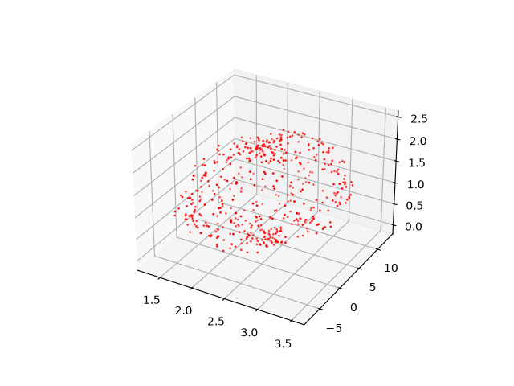

# Magnetometer-Calibration

This repository allows developers to calibrate raw magnitometer sensor data into a unit sphere.
The calibrated data can then be used for orientation estimation for UAV or heading estimation fro ground vehicles.

### Raw Uncalibarated Data:

    

    <i> Figure 1: 3-D scatter plot of uncalibrated sensor data </i>

    <i> Figure 2: Orthogonal projections & histogram of 3-D scatter plot </i>

